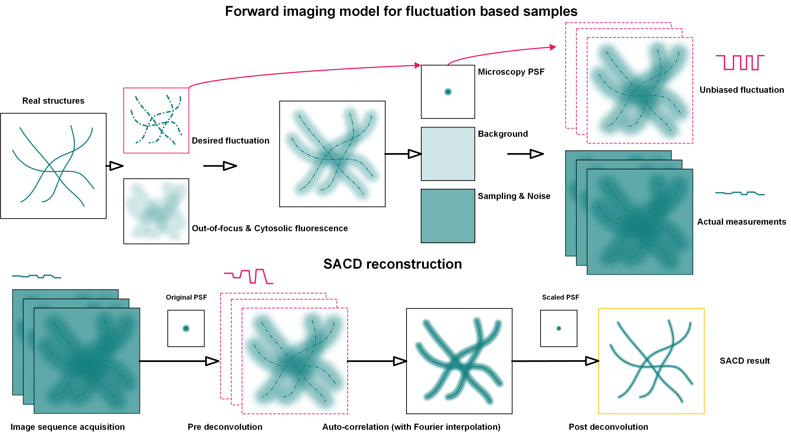

[](https://weisongzhao.github.io/SACDm/)
[](https://www.science.org/)
[](https://github.com/WeisongZhao/SACDm/)
[](https://github.com/WeisongZhao/SACDm/blob/master/LICENSE/)<br>
[](https://twitter.com/weisong_zhao/status/1370308101690118146)
[](https://github.com/WeisongZhao/SACDm/) 
[](https://github.com/WeisongZhao/SACDm/) 
[](https://github.com/WeisongZhao/SACDm/)

<p>
<h1 align="center">SACD<font color="#b07219">m</font></h1>
<h5 align="center">Fater super-resolution fluctuation imaging: SACD reconstruction with MATLAB.</h5>
<h6 align="right">v0.2.0</h6>
</p>
<br>

<!-- <p>

<p> -->

<p>

</p>
This repository is for SACD reconstruction, and it will be in continued development. It is distributed as accompanying software for publication: [Weisong Zhao et al. High-throughput and four-dimensional live-cell super-resolution imaging, XXX (2022)](https://www.science.org/). Please cite SACD in your publications, if it helps your research.
<br>
<br>
<br>

<!-- <p>

</p>
<br>

[Portal]() to the plugin. -->

## SACD reconstruction

<p align='center'>

</p>

## Instruction

- The SACD reconstruction requires resolution-related parameter to execute deconvolution, you can give it with objective-NA; wavelength (nm); and pixel-size (nm), or just provide resolution and pixel-size, or feed it with your own PSF. Here are 3 examples:
```python
SRimg = SACDm(imgstack, 'pixel', 65, 'NA', 1.3, 'wavelength', 561);
SRimg = SACDm(imgstack, 'pixel', 65, 'resolution', 250);
SRimg = SACDm(imgstack, 'psf', ownpsf);
```

- Please try help to get the API.
```python
addpath(genpath('SACDm')); 
help SACDm
```


## Declaration
This repository contains the MATLAB source code for <b>SACD</b> .  

If you are not a MATLAB user, you can have a try on the imagej version of SACD: [SACDj](https://github.com/WeisongZhao/SACDj).

<p>

</p>
<br>
<br>

## Version
- v0.2.0 Sparse-SACD reconstruction core
- v0.1.0 SACD reconstruction core

## Related links: 
- ImageJ plug-in version of SACD: [SACDj](https://github.com/WeisongZhao/SACDj)
- **Some fancy results and comparisons:** [my website](https://weisongzhao.github.io/MyWeb2/portfolio-4-col.html)
- **Preprint:** [COMING SOON...](#)
- **Reference:**

<details>
<summary><b>Plans</b></summary>

- Full FRC assisted SACD;
- Full 3D-SACD;
- GPU acceleration.
</details>

## Open source [SACDm](https://github.com/WeisongZhao/SACDm)
This software and corresponding methods can only be used for **non-commercial** use, and they are under Open Data Commons Open Database License v1.0.